# Repository Documentation

## Repository Architecture

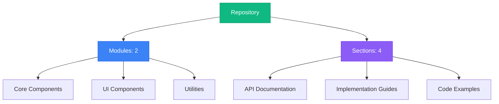

## Table of Contents

### 1. Author Profile Display and Prisma Client Optimization

No description available

**Sections:**


**1.** [Accelerated Prisma Client Initialization for Hono Applications](#section-link-module-module_miscellaneous_utilities-section-optimized_accelerated_prisma_client_initialization_for_hono_applications)

**2.** [Echoink: Displaying Author Profiles and Posts with React](#section-link-module-module_miscellaneous_utilities-section-optimized_echoink:_displaying_author_profiles_and_posts_with_react)

---

### 2. Frontend Data Flow & State Management for Single Post Views

No description available

**Sections:**


**1.** [Centralized State Management with Recoil.js for User and Post Data in Echoink Frontend](#section-link-module-module_api_endpoints_routing-section-optimized_centralized_state_management_with_recoil.js_for_user_and_post_data_in_echoink_frontend)

**2.** [Displaying and Sharing Individual Posts: A React Component for EchoInk](#section-link-module-module_api_endpoints_routing-section-optimized_displaying_and_sharing_individual_posts:_a_react_component_for_echoink)

---


## Navigation Guide

- **Modules**: Browse through organized code modules in the left sidebar
- **Sections**: Each module contains multiple documentation sections
- **Search**: Use the search bar to quickly find specific content
- **Headings**: Use the right sidebar to navigate within long documents
- **Actions**: Copy or download any section content using the toolbar buttons

Start exploring by selecting a module from the sidebar!


## Prisma Client Initialization and Acceleration in Echoink Backend

This document details the `prismaClient.ts` module within the Echoink backend, focusing on its role in initializing and configuring the Prisma client for database interactions. The module leverages Prisma's edge client and the `prisma-extension-accelerate` extension to provide a performant and scalable database access layer within a Hono application.

### Overview

The primary function of this module is to provide a centralized and configured Prisma client instance for use throughout the Echoink backend. This client is initialized with the database URL from the Hono context's environment variables and extended with the `withAccelerate` extension. This extension optimizes query performance by leveraging Prisma Accelerate.

### Technical Architecture

The module consists of a single function, `getPrismaClient`, which is responsible for creating and configuring the Prisma client.

**Components:**

*   **`prismaClient.ts`**: This module encapsulates the Prisma client initialization logic.
*   **`@prisma/client/edge`**: Prisma's edge client, optimized for serverless environments.
*   **`@prisma/extension-accelerate`**: Prisma's extension for query acceleration.
*   **`hono`**: The Hono web framework, providing the context (`c`) containing the environment variables.

**Component Relationships:**

The `prismaClient.ts` module imports `PrismaClient` from `@prisma/client/edge`, `withAccelerate` from `@prisma/extension-accelerate`, and `Context` from `hono`. It then uses these imported components to create and configure the Prisma client instance.

**Data Flow:**

1.  The `getPrismaClient` function is called with a Hono `Context` object.
2.  The function retrieves the `DATABASE_URL` from the `c.env` object.
3.  A new `PrismaClient` instance is created, configured with the `DATABASE_URL`.
4.  The `withAccelerate` extension is applied to the `PrismaClient` instance.
5.  The configured Prisma client instance is returned.

### Workflow Analysis

**Workflow: Prisma Client Initialization**

This workflow describes the steps involved in initializing the Prisma client with acceleration.

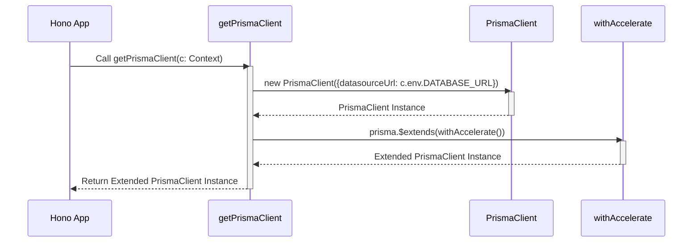

**Explanation:**

1.  The Hono application calls the `getPrismaClient` function, passing the Hono context.
2.  `getPrismaClient` creates a new `PrismaClient` instance, configuring it with the database URL from the context's environment.
3.  The `withAccelerate` extension is applied to the `PrismaClient` instance, enhancing its query performance.
4.  The extended `PrismaClient` instance is returned to the Hono application.

### Code Examples

**Example: Retrieving and Using the Prisma Client**

```typescript
import { Hono } from 'hono'
import { getPrismaClient } from './prisma/prismaClient'

const app = new Hono()

app.get('/users', async (c) => {
  const prisma = await getPrismaClient(c);
  const users = await prisma.user.findMany();
  return c.json(users);
})

export default app
```

In this example, the `getPrismaClient` function is used within a Hono route handler to retrieve the configured Prisma client. The client is then used to fetch all users from the database.

### Usage Guide

1.  **Import `getPrismaClient`:** Import the `getPrismaClient` function into the module where you need to access the database.
2.  **Call `getPrismaClient`:** Call the `getPrismaClient` function, passing the Hono context (`c`) as an argument. This will return the configured Prisma client instance.
3.  **Use the Prisma Client:** Use the returned Prisma client instance to perform database operations, such as querying, creating, updating, and deleting data.

### Implementation Details and Gotchas

*   **Environment Variables:** Ensure that the `DATABASE_URL` environment variable is properly set in your Hono application's environment. This variable should contain the connection string to your database.
*   **Asynchronous Initialization:** The `getPrismaClient` function is asynchronous, so you must use `await` when calling it.
*   **Prisma Accelerate:** The `withAccelerate` extension requires a Prisma Data Proxy. Ensure that you have configured the Data Proxy correctly in your Prisma schema and environment.

### Common Issues and Troubleshooting

*   **Database Connection Errors:** If you encounter database connection errors, verify that the `DATABASE_URL` environment variable is correct and that your database server is running and accessible.
*   **Prisma Accelerate Errors:** If you encounter errors related to Prisma Accelerate, ensure that you have configured the Data Proxy correctly and that your Prisma schema is compatible with Accelerate.
*   **Type Errors:** If you encounter type errors, ensure that you have installed the correct Prisma client version and that your TypeScript configuration is properly set up.

### Advanced Configuration and Customization Options

*   **Prisma Client Configuration:** You can customize the Prisma client by passing additional options to the `PrismaClient` constructor. For example, you can configure logging, error handling, and connection pooling.
*   **Prisma Accelerate Configuration:** You can configure Prisma Accelerate by passing options to the `withAccelerate` extension. For example, you can configure the cache TTL and the number of retries.

### Performance Considerations and Optimization Strategies

*   **Connection Pooling:** Prisma's built-in connection pooling helps to improve performance by reusing database connections.
*   **Query Optimization:** Use Prisma's query optimization features, such as eager loading and filtering, to reduce the number of database queries.
*   **Caching:** Prisma Accelerate provides caching capabilities that can significantly improve query performance.

### Security Implications and Best Practices

*   **Database Credentials:** Protect your database credentials by storing them in environment variables and avoiding hardcoding them in your code.
*   **Input Validation:** Validate all user input to prevent SQL injection attacks.
*   **Principle of Least Privilege:** Grant database users only the privileges they need to perform their tasks.

### Enhanced Flow and Connection Documentation

**Dependency Chain:**

```
Hono App --> prismaClient.ts --> @prisma/client/edge
prismaClient.ts --> @prisma/extension-accelerate
```

**Error Propagation:**

Errors during Prisma client initialization or database operations will be propagated to the Hono application, where they can be handled appropriately.

**Connection Example:**

```typescript
// Example of using the Prisma client to create a new user
import { getPrismaClient } from './prisma/prismaClient';
import { Context } from 'hono';

async function createUser(c: Context, email: string, name: string) {
  const prisma = await getPrismaClient(c);
  try {
    const user = await prisma.user.create({
      data: {
        email: email,
        name: name,
      },
    });
    return user;
  } catch (error) {
    console.error("Failed to create user:", error);
    throw error; // Re-throw the error to be handled by the caller
  }
}
```

This example demonstrates how to use the Prisma client to create a new user in the database. It also includes error handling to catch any exceptions that may occur during the database operation.

**Workflow Visualization: Error Handling**

This diagram illustrates how errors are handled during the Prisma client initialization and usage.

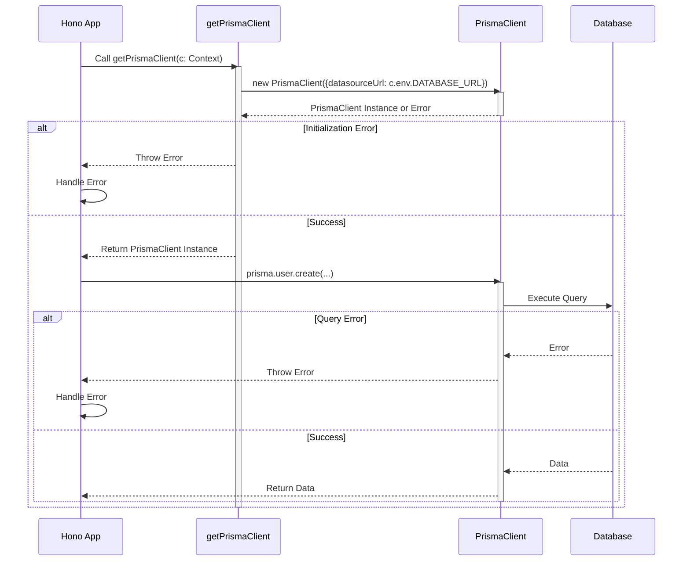

**Explanation:**

1.  The Hono app calls `getPrismaClient`.
2.  `getPrismaClient` attempts to initialize the Prisma client.
3.  If initialization fails (e.g., invalid `DATABASE_URL`), an error is thrown back to the Hono app for handling.
4.  If initialization succeeds, the Hono app uses the Prisma client to execute a database query.
5.  If the query fails, the database returns an error, which is propagated back to the Hono app for handling.
6.  If the query succeeds, the database returns the requested data to the Hono app.

This documentation provides a comprehensive overview of the `prismaClient.ts` module, its role in initializing and configuring the Prisma client, and its integration with the Hono web framework. It includes detailed explanations, code examples, and troubleshooting tips to help developers effectively use this module in their Echoink backend applications.

## AuthorView Component Documentation

This document provides a comprehensive overview of the `AuthorView` component, a React component responsible for displaying author profiles and their associated posts within the Echoink application. It covers the component's functionality, architecture, data flow, usage, and potential issues.

### Overview

The `AuthorView` component is a crucial part of the Echoink frontend, enabling users to view detailed information about specific authors and browse their published posts. It fetches author data from the backend API based on the author's ID, renders the author's profile information (avatar, username, bio, etc.), and displays a list of their posts using the `PostCard` component. This component enhances user engagement by providing a dedicated space for exploring content created by individual authors.

### Technical Architecture

The `AuthorView` component is built using React and leverages several key libraries and components:

*   **React:** The core UI library for building the component's structure and managing its state.
*   **`react-router-dom`:** Used for accessing the `authorId` from the URL parameters via the `useParams` hook.
*   **`@mui/material`:** Provides pre-built UI components like `Avatar`, `Box`, `Chip`, `Typography`, and `Skeleton` for styling and layout.
*   **`PostCard`:** A custom component (lazily loaded) responsible for rendering individual posts.
*   **`BASE_URL`:** A constant defining the base URL of the Echoink backend API.
*   **`Post` and `Author` Types:** Typescript types defining the structure of the data received from the API.

The component's architecture can be summarized as follows:

1.  **Initialization:** The component retrieves the `authorId` from the URL using `useParams`.
2.  **Data Fetching:** It uses the `getAuthorDetails` function to fetch author data (including the author's posts) from the backend API.
3.  **State Management:** The component uses the `useState` hook to manage the following state variables:
    *   `author`: Stores the fetched author object (or `null` if not found).
    *   `posts`: Stores the array of posts associated with the author.
    *   `loading`: Indicates whether the data is currently being fetched.
4.  **Rendering:** Based on the state, the component renders:
    *   A loading state with `Skeleton` components while `loading` is true.
    *   An "Author not found" message if `author` is null.
    *   The author's profile information and a list of their posts if `author` is populated.

### Data Flow

The data flow within the `AuthorView` component can be visualized as follows:

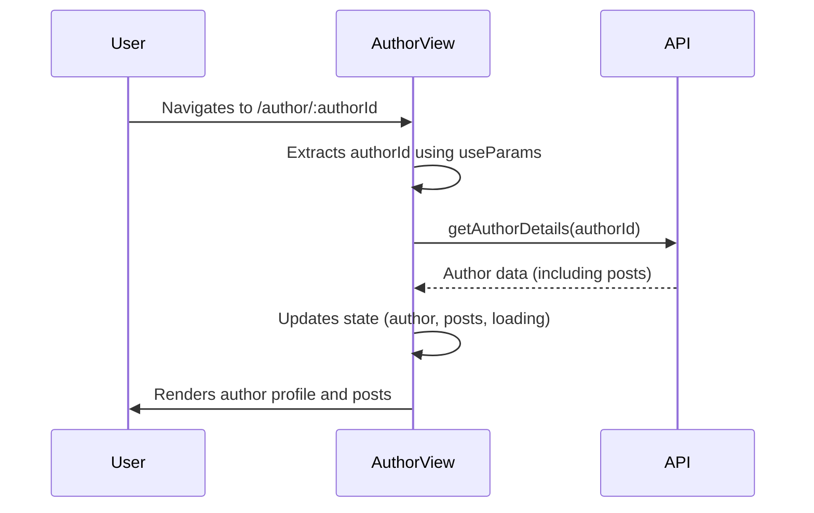

**Step-by-step analysis:**

1.  **User Navigation:** A user navigates to the author view page, e.g., `/author/123`.
2.  **`authorId` Extraction:** The `useParams` hook extracts the `authorId` (e.g., "123") from the URL.
3.  **API Request:** The `getAuthorDetails` function is called with the `authorId` to fetch the author's data from the backend API.
4.  **Data Retrieval:** The API returns the author's data, including their profile information and an array of posts.
5.  **State Update:** The `AuthorView` component updates its state with the fetched author data and posts. The `loading` state is set to `false`.
6.  **Rendering:** The component re-renders, displaying the author's profile information and a list of their posts using the `PostCard` component.

### Code Examples

#### Fetching Author Details

The `getAuthorDetails` function is responsible for fetching author data from the backend API:

```typescript
const getAuthorDetails = async (userId: string) => {
    const response = await fetch(`${BASE_URL}/author/${userId}`);
    const data = await response.json();
    return data;
};
```

This function takes the `userId` as input, constructs the API endpoint URL using `BASE_URL`, makes a `fetch` request to the API, and returns the parsed JSON response.

#### Using `useEffect` to Fetch Data

The `useEffect` hook is used to fetch author data when the component mounts or when the `authorId` changes:

```typescript
useEffect(() => {
    const fetchAuthorData = async () => {
        try {
            const { user } = await getAuthorDetails(authorId);
            setAuthor(user);
            setPosts(user.posts);
        } catch (error) {
            console.error("Error fetching author data:", error);
        } finally {
            setLoading(false);
        }
    };

    fetchAuthorData();
}, [authorId]);
```

This `useEffect` hook calls the `fetchAuthorData` function, which fetches the author data using `getAuthorDetails`, updates the component's state with the fetched data, and handles potential errors. The `[authorId]` dependency ensures that the effect is re-run whenever the `authorId` changes.

#### Rendering the Author Profile

The component renders the author's profile information using MUI components:

```typescript
<Box sx={{ display: "flex", alignItems: "center", mb: 2 }}>
    <Avatar
        alt={author.username}
        src={author.image_link || ""}
        sx={{ width: 80, height: 80, mr: 2 }}
    />
    <Typography variant="h5">{author.username}</Typography>
</Box>
<Typography variant="body1">{author.bio || "No bio available."}</Typography>
```

This code snippet displays the author's avatar, username, and bio. It uses the `Avatar` component to display the author's profile picture, the `Typography` component to display the username and bio, and the `Box` component to provide layout and styling.

### Usage Guide

To use the `AuthorView` component, you need to:

1.  Import the component into your desired location.
2.  Wrap the component with a `Route` from `react-router-dom` and provide the correct path with the `authorId` parameter.
3.  Ensure that the `authorId` parameter is correctly passed to the component through the URL.

**Example:**

```typescript
import { BrowserRouter as Router, Route, Routes } from 'react-router-dom';
import AuthorView from './pages/AuthorView';

function App() {
  return (
    <Router>
      <Routes>
        <Route path="/author/:authorId" element={<AuthorView />} />
      </Routes>
    </Router>
  );
}

export default App;
```

In this example, the `AuthorView` component will be rendered when the user navigates to a URL like `/author/123`.

### Implementation Details and Gotchas

*   **Error Handling:** The component includes basic error handling to catch potential errors during data fetching. However, more robust error handling may be required for production environments.
*   **Loading State:** The component displays a loading state using `Skeleton` components while data is being fetched. This provides a better user experience by indicating that the data is loading.
*   **Lazy Loading:** The `PostCard` component is lazily loaded using `React.lazy`. This improves the initial loading performance of the `AuthorView` component by deferring the loading of the `PostCard` component until it is actually needed.
*   **API Endpoint:** The `BASE_URL` constant should be configured correctly to point to the correct backend API endpoint.
*   **Data Structure:** The component expects the author data to be in a specific format, as defined by the `Author` type. Ensure that the backend API returns data in the expected format.

### Common Issues and Troubleshooting

*   **Author Not Found:** If the `authorId` is invalid or the author does not exist, the component will display an "Author not found" message. Verify that the `authorId` is correct and that the author exists in the database.
*   **Data Fetching Errors:** If there are errors during data fetching, the component will log an error message to the console. Check the console for error messages and investigate the cause of the error. Potential causes include network connectivity issues, API endpoint errors, or incorrect API configuration.
*   **Rendering Issues:** If the component is not rendering correctly, check the component's state and props to ensure that they are being updated correctly. Also, check the console for any error messages or warnings.

### Advanced Configuration and Customization Options

*   **Custom Styling:** The component can be customized using CSS or MUI's styling options. You can override the default styles of the MUI components to match your application's design.
*   **Custom Data Fetching:** You can replace the default `getAuthorDetails` function with a custom function to fetch author data from a different source or to modify the data before it is rendered.
*   **Custom Post Rendering:** You can replace the `PostCard` component with a custom component to render posts in a different way.

### Performance Considerations and Optimization Strategies

*   **Lazy Loading:** The `PostCard` component is lazily loaded to improve initial loading performance.
*   **Memoization:** You can use `React.memo` to memoize the `AuthorView` component and the `PostCard` component to prevent unnecessary re-renders.
*   **Code Splitting:** You can use code splitting to split the component's code into smaller chunks, which can be loaded on demand.
*   **Image Optimization:** Optimize the author's profile picture to reduce its file size and improve loading performance.

### Security Implications and Best Practices

*   **Data Validation:** Validate the `authorId` parameter to prevent potential security vulnerabilities, such as SQL injection attacks.
*   **Authentication and Authorization:** Implement proper authentication and authorization mechanisms to ensure that only authorized users can access author data.
*   **Cross-Site Scripting (XSS) Protection:** Sanitize the author's bio and other user-generated content to prevent XSS attacks.
*   **HTTPS:** Use HTTPS to encrypt communication between the client and the server to protect sensitive data.

### Workflow Visualization

The following diagram illustrates the workflow of displaying author profiles and posts:

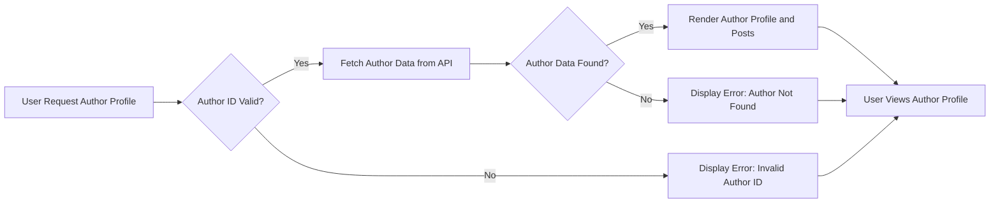

**Explanation:**

1.  The user requests an author profile.
2.  The system checks if the author ID is valid.
3.  If the author ID is valid, the system fetches the author data from the API.
4.  If the author ID is invalid, the system displays an error message.
5.  If the author data is found, the system renders the author profile and posts.
6.  If the author data is not found, the system displays an error message.
7.  The user views the author profile.

### Component Relationships

The `AuthorView` component depends on the following components and modules:

```mermaid
graph LR
    A[AuthorView] --> B[PostCard];
    A --> C[@mui/material];
    A --> D[react-router-dom];
    A --> E[BASE_URL];
```

**Explanation:**

*   `AuthorView` uses `PostCard` to render individual posts.
*   `AuthorView` uses `@mui/material` for UI components.
*   `AuthorView` uses `react-router-dom` to access the `authorId` from the URL.
*   `AuthorView` uses `BASE_URL` to construct the API endpoint URL.

This documentation provides a comprehensive overview of the `AuthorView` component, covering its functionality, architecture, data flow, usage, and potential issues. It should serve as a valuable resource for developers working with this component.

# Echoink Frontend and Backend System Documentation

This document provides a comprehensive overview of the Echoink frontend and backend system, detailing its architecture, workflows, and implementation. It aims to equip developers with the knowledge necessary to understand, use, and maintain the system effectively.

## 1. System Overview

Echoink is a platform designed for creating and sharing content. The frontend, built with React, Recoil, and Material UI, provides the user interface for interacting with the platform. The backend, built with Hono, handles user authentication, post management, and data persistence using Prisma.

### 1.1. Key Features

*   **User Authentication:** Secure signup and sign-in functionality.
*   **Post Management:** Create, read, update, and delete posts.
*   **Profile Management:** User profile creation and editing.
*   **Content Display:** Homepage displaying posts with filtering and search.
*   **Rich Text Editor:** A rich text editor for creating engaging content.
*   **Image Upload:** Upload images to Cloudinary for use in posts.
*   **Tagging:** Categorize posts using tags.

## 2. Architecture

The Echoink system follows a modular architecture, separating the frontend and backend concerns. The frontend interacts with the backend via RESTful APIs.

### 2.1. Frontend Architecture

The frontend is structured using React components, managed with Recoil for state management, and styled with Material UI and Tailwind CSS.

#### 2.1.1. Key Components

*   **`App.tsx`:** The root component that defines the application's routing using `react-router-dom`. It uses React.lazy and Suspense for code splitting and lazy loading of components.
*   **`Layout.tsx`:** Provides a consistent layout structure, including the `Navbar`.
*   **`Navbar.tsx`:** Handles navigation, authentication status, and user profile retrieval. It uses `useRecoilState` to manage user data.
*   **`Home.tsx`:** Displays the main feed of posts, including featured categories and latest insights. It fetches posts from the backend and uses `useRecoilState` to manage the post state.
*   **`Write.tsx`:** Provides the interface for creating new posts, including a rich text editor, image upload, and tag management.
*   **`Profile.tsx`:** Displays user profile information and allows editing.
*   **`Signin.tsx` and `Signup.tsx`:** Handle user authentication.
*   **`RichTextEditor.tsx`:** A rich text editor component built with Tiptap.
*   **`SearchBar.tsx`:** A search bar component that allows users to search for posts.
*   **`store.ts`:** Defines the Recoil atoms for managing global state, including user information and posts.

#### 2.1.2. Data Flow

The frontend uses Recoil.js for centralized state management. The `userAtom` stores user authentication information, and `postsState` stores the list of posts. Components like `Home.tsx`, `Write.tsx`, and `Profile.tsx` interact with these atoms to display and modify data.

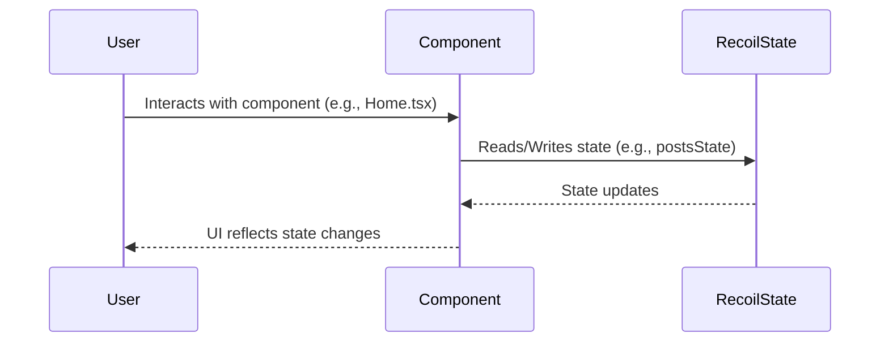

### 2.2. Backend Architecture

The backend is built with Hono, a lightweight web framework for Cloudflare Workers. It uses Prisma as an ORM to interact with the database.

#### 2.2.1. Key Components

*   **`index.ts`:** The main entry point for the backend application. It defines the API routes and middleware.
*   **`prisma/prismaClient.ts`:** Configures and exports the Prisma client for database interactions.
*   **`src/userMiddleware.ts`:** Contains middleware functions for user authentication, authorization, and data validation.
*   **`utils/render_txt.ts`:** Defines HTML templates for various responses, such as the homepage, 404 error page, and email verification page.
*   **`utils/sendEmail.ts`:** Implements email sending functionality using SendGrid.
*   **`utils/email_bodies.ts`:** Defines the email bodies for various email notifications.

#### 2.2.2. API Endpoints

The backend exposes the following API endpoints:

*   `POST /signup`: Registers a new user.
*   `POST /signin`: Authenticates an existing user.
*   `GET /getprofile`: Retrieves user profile information.
*   `PUT /updateprofile`: Updates user profile information.
*   `POST /createpost`: Creates a new post.
*   `DELETE /deletepost/:postId`: Deletes a post.
*   `PUT /updatepost/:postId`: Updates a post.
*   `GET /getbulk`: Retrieves all posts.
*   `GET /posts?search={query}`: Retrieves posts based on a search query.
*   `GET /getpost/:postId`: Retrieves a single post by ID.
*   `GET /getauthor/:authorId`: Retrieves posts by author ID.

#### 2.2.3. Data Flow

The backend receives requests from the frontend, processes them using middleware and route handlers, interacts with the database via Prisma, and returns JSON responses.

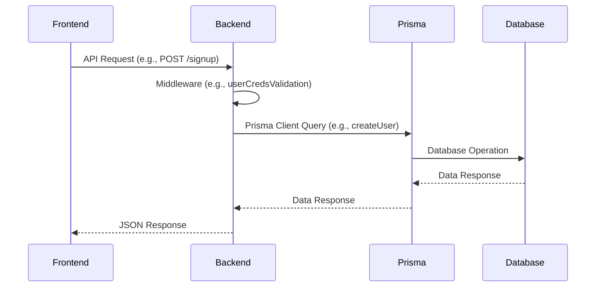

## 3. Workflows

### 3.1. User Signup Workflow

1.  The user enters their username, password, and confirm password in the `Signup.tsx` component.
2.  The `handleSubmit` function in `Signup.tsx` is called.
3.  The function validates the input fields and displays error messages using `react-toastify` if any validation fails.
4.  A `POST` request is sent to the `/signup` endpoint on the backend.
5.  The backend receives the request and applies the `userCredsValidation` middleware to validate the username and password.
6.  The backend hashes the password using `bcrypt` and creates a new user in the database using Prisma.
7.  The backend generates a JWT token for the user.
8.  The backend sends a JSON response containing the token and user data to the frontend.
9.  The frontend stores the token in `localStorage` and sets the user data in the `userAtom` using `useSetRecoilState`.
10. The frontend navigates the user to the homepage.

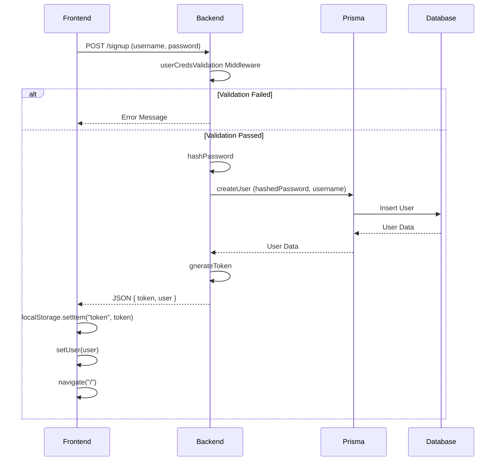

### 3.2. Create Post Workflow

1.  The user navigates to the `Write.tsx` component.
2.  The user enters the post title, description, and tags. They can also upload an image.
3.  The user clicks the "Publish" button.
4.  The `handleSubmit` function in `Write.tsx` is called.
5.  The function validates the input fields and displays error messages using `react-toastify` if any validation fails.
6.  A `POST` request is sent to the `/createpost` endpoint on the backend with the post data.
7.  The backend receives the request and applies the `userAuth` middleware to authenticate the user.
8.  The backend creates a new post in the database using Prisma, associating it with the authenticated user.
9.  The backend sends a JSON response indicating success or failure to the frontend.
10. The frontend displays a success or error message using `react-toastify`.
11. The frontend navigates the user to their profile page.

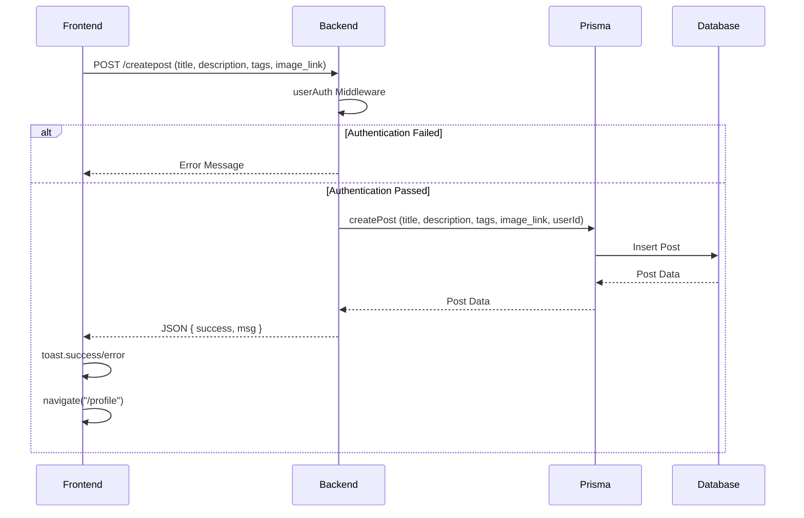

### 3.3. Get Profile Workflow

1.  The `Profile.tsx` component is mounted.
2.  The `useEffect` hook in `Profile.tsx` is called.
3.  The hook checks if a token exists in `localStorage`. If not, the user is redirected to the sign-in page.
4.  A `GET` request is sent to the `/getprofile` endpoint on the backend with the authorization token in the header.
5.  The backend receives the request and applies the `userAuth` middleware to authenticate the user.
6.  The backend retrieves the user profile information from the database using Prisma.
7.  The backend sends a JSON response containing the user profile data to the frontend.
8.  The frontend sets the profile data in the component's state using `setProfile`.
9.  The frontend renders the user profile information.

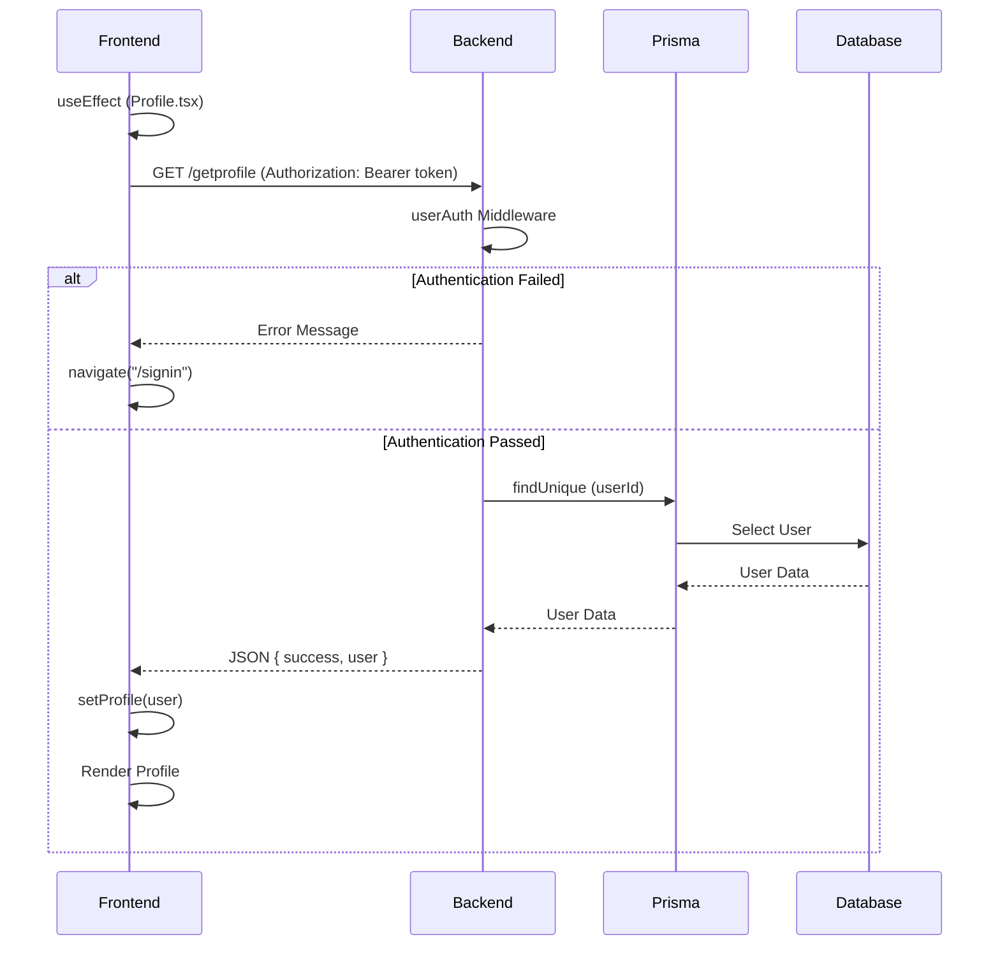

## 4. Code Examples

### 4.1. Recoil State Definition (`store.ts`)

```typescript
import { atom } from 'recoil';

export interface User {
  id: string;
  username: string;
  email?: string;
  image_link?: string;
  created_at: string;
  posts: Post[];
  _count: {
    posts: number;
  };
}

export const userAtom = atom<User | null>({
  key: "userAtom",
  default: null,
});

export const postsState = atom<Post[]>({
  key: "postsState",
  default: [],
});
```

This code defines two Recoil atoms: `userAtom` and `postsState`. `userAtom` stores the current user's information, and `postsState` stores the list of posts.

### 4.2. Signup Form Submission (`signup.tsx`)

```typescript
import { useState } from "react";
import { useNavigate, Link } from "react-router-dom";
import { useSetRecoilState } from "recoil";
import { userAtom } from "../store/store";
import { toast } from "react-toastify";
import { BASE_URL } from "./Home";

export default function Signup() {
  const navigate = useNavigate();
  const setUser = useSetRecoilState(userAtom);
  const [formData, setFormData] = useState({
    username: "",
    password: "",
    confirmPassword: "",
  });

  const handleSubmit = async (e: React.FormEvent) => {
    e.preventDefault();

    try {
      const response = await fetch(`${BASE_URL}/signup`, {
        method: "POST",
        headers: {
          "Content-Type": "application/json",
        },
        body: JSON.stringify({
          username: formData.username,
          password: formData.password,
        }),
      });

      const data = await response.json();

      if (data.success) {
        localStorage.setItem("token", data.token);
        setUser(data.user);
        toast.success("Account created successfully!");
        navigate("/");
      } else {
        toast.error(data.msg || "Failed to create account");
      }
    } catch (error: any) {
      toast.error(error.message || "Failed to create account");
    }
  };

  return (
    // JSX for signup form
    null
  );
}
```

This code demonstrates the signup form submission process. It fetches the `/signup` endpoint, handles the response, and updates the Recoil state and `localStorage` upon successful signup.

### 4.3. Fetching Posts (`Home.tsx`)

```typescript
import { useEffect, useState } from "react";
import { useRecoilState } from "recoil";
import { postsState, Post } from "../store/store";
import { toast } from "react-toastify";
import { BASE_URL } from "./Home";

export default function Homepage() {
  const [posts, setPosts] = useRecoilState<Post[]>(postsState);
  const [loading, setLoading] = useState(true);

  useEffect(() => {
    const fetchPosts = async () => {
      try {
        const res = await fetch(`${BASE_URL}/getbulk`);
        const data = await res.json();

        if (data.success) {
          setPosts(data.posts);
          toast.success("Posts loaded successfully");
        } else {
          toast.error(data.msg);
        }
      } catch (error) {
        toast.error("Failed to fetch posts");
      } finally {
        setLoading(false);
      }
    };

    fetchPosts();
  }, []);

  return (
    // JSX for displaying posts
    null
  );
}
```

This code demonstrates how to fetch posts from the backend and update the `postsState` Recoil atom.

### 4.4. Creating a Post (`Write.tsx`)

```typescript
import { useState, useEffect } from "react";
import { useNavigate } from "react-router-dom";
import { toast } from "react-toastify";
import RichTextEditor from '../components/RichTextEditor';

const BASE_URL = 'https://echoink-backend.cloudflare-apis.workers.dev';

interface PostForm {
    title: string;
    description: string;
    image_link: string;
    tags: string[];
}

export default function Write() {
    const [formData, setFormData] = useState<PostForm>({
        title: "",
        description: "",
        image_link: "",
        tags: [],
    });
    const navigateTo = useNavigate();

    useEffect(() => {
        const token = localStorage.getItem("token");
        if (!token) {
            toast.error("Please sign in to create a post");
            navigateTo("/signin");
        }
    }, [navigateTo]);

    const handleSubmit = async (e: React.FormEvent) => {
        e.preventDefault();

        try {
            const token = localStorage.getItem("token");
            if (!token) throw new Error("Authentication required");

            const response = await fetch(`${BASE_URL}/createpost`, {
                method: "POST",
                headers: {
                    "Content-Type": "application/json",
                    Authorization: `Bearer ${token}`,
                },
                body: JSON.stringify(formData),
            });

            const data = await response.json();
            if (!response.ok) throw new Error(data.message || 'Failed to create post');

            toast.success("Post published successfully!");
            navigateTo("/profile");
        } catch (error: any) {
            toast.error(error.message || "Failed to publish post");
        }
    };

    return (
        // JSX for creating a post
        null
    );
}
```

This code demonstrates how to create a new post by sending a `POST` request to the `/createpost` endpoint.

### 4.5. User Authentication Middleware (`index.ts`)

```typescript
import { Context, Next } from 'hono';
import { verify } from 'hono/jwt';

export const userAuth = async (c: Context, next: Next) => {
  const token = c.req.header('Authorization')?.split(' ')[1];

  if (!token) {
    return c.json({ msg: "Unauthorized", success: false }, 401);
  }

  try {
    const decoded = await verify(token, 'secret');
    if (decoded) {
      c.set('userId', decoded.id);
      await next();
    } else {
      return c.json({ msg: "Unauthorized", success: false }, 401);
    }
  } catch (error) {
    return c.json({ msg: "Unauthorized", success: false }, 401);
  }
};
```

This code demonstrates the `userAuth` middleware, which authenticates the user by verifying the JWT token in the `Authorization` header.

## 5. Usage Guide

### 5.1. Setting up the Development Environment

1.  Clone the repository.
2.  Install the dependencies for both the frontend and backend.
3.  Configure the environment variables, including the database connection string, Cloudinary credentials, and SendGrid API key.
4.  Start the frontend and backend development servers.

### 5.2. Creating a New Post

1.  Navigate to the `Write` page.
2.  Enter the post title, description, and tags.
3.  Upload an image (optional).
4.  Click the "Publish" button.

### 5.3. Editing User Profile

1.  Navigate to the `Profile` page.
2.  Edit the profile information, including the username, email, and profile picture.
3.  Click the "Save" button.

## 6. Implementation Details and Gotchas

*   **Recoil State Management:** Ensure that all components that need access to the global state are wrapped with the `RecoilRoot` component.
*   **Authentication:** The JWT token is stored in `localStorage`. Ensure that the token is securely stored and handled.
*   **Error Handling:** Implement comprehensive error handling throughout the application to provide informative error messages to the user.
*   **Cloudinary:** Configure the Cloudinary upload preset and cloud name correctly.
*   **SendGrid:** Replace `'SENDGRID_API_KEY'` with your actual SendGrid API key in `sendEmail.ts`.

## 7. Common Issues and Troubleshooting

*   **Authentication Issues:** Verify that the JWT token is valid and correctly stored in `localStorage`.
*   **Database Connection Issues:** Ensure that the database connection string is correct and that the database server is running.
*   **Image Upload Issues:** Verify that the Cloudinary credentials are correct and that the image file size is within the allowed limit.
*   **Email Sending Issues:** Verify that the SendGrid API key is correct and that the email sending quota has not been exceeded.

## 8. Advanced Configuration and Customization Options

*   **Theming:** Customize the application's theme using Material UI's theming capabilities.
*   **Routing:** Add new routes to the application by modifying the `App.tsx` component.
*   **Middleware:** Add new middleware functions to the backend to handle specific requests or perform custom logic.
*   **Database Schema:** Modify the database schema by editing the Prisma schema file.

## 9. Performance Considerations and Optimization Strategies

*   **Code Splitting:** Use code splitting to reduce the initial load time of the application.
*   **Lazy Loading:** Use lazy loading to load components only when they are needed.
*   **Caching:** Implement caching to reduce the number of database queries.
*   **Image Optimization:** Optimize images to reduce their file size.

## 10. Security Implications and Best Practices

*   **Authentication:** Use strong passwords and implement multi-factor authentication.
*   **Authorization:** Implement proper authorization checks to ensure that users can only access the resources they are authorized to access.
*   **Data Validation:** Validate all user input to prevent injection attacks.
*   **Cross-Site Scripting (XSS):** Sanitize all user input to prevent XSS attacks.
*   **Cross-Site Request Forgery (CSRF):** Implement CSRF protection to prevent CSRF attacks.
*   **HTTPS:** Use HTTPS to encrypt all communication between the client and server.
*   **Regular Security Audits:** Conduct regular security audits to identify and address potential vulnerabilities.

  ## EchoInk Post Display and Sharing System: Technical Documentation

This document provides a comprehensive technical overview of the EchoInk post display and sharing system. It covers the frontend components responsible for rendering individual posts and facilitating sharing, as well as the backend middleware involved in user authentication and authorization.

### 1. System Overview

The EchoInk post display and sharing system allows users to view individual blog posts, share them on social media, and interact with author profiles. This system is crucial for content discoverability, user engagement, and platform growth. The core functionality revolves around fetching post data from the backend, rendering it in a user-friendly format, and providing sharing options.  User authentication is handled by backend middleware to ensure secure access and data integrity.

### 2. Technical Architecture

The system comprises the following key components:

*   **`SinglePostView.tsx`**:  This React component fetches and displays a single post based on its ID. It handles data fetching, error handling, and rendering of post content, metadata, and sharing options.
*   **`postCard.tsx`**: This React component displays a summary of a post, used in lists of posts. It also provides navigation to the full `SinglePostView`. It can optionally include edit and delete actions if the user has permission.
*   **`userMiddleware.ts`**: This backend module provides middleware functions for user authentication, authorization, and data validation. It ensures that only authorized users can access certain resources and that data is consistent and secure.

**Component Relationships:**

*   `SinglePostView.tsx` imports `Post` type from `../store/store` and uses `BASE_URL` which is defined in `./Home`. It also utilizes `toast` from `react-toastify` for user notifications.
*   `postCard.tsx` uses `useNavigate` from `react-router-dom` to handle navigation to the single post view and author profiles.
*   `userMiddleware.ts` imports `Context` and `Next` from `hono`, uses `bcryptjs` for password hashing, `zod` for data validation, `hono/jwt` for JWT signing and verification, and `getPrismaClient` from `../prisma/prismaClient` to interact with the database.

**Data Flow Diagram:**

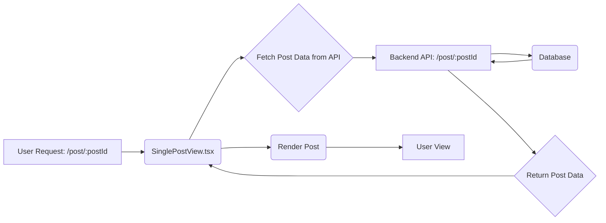

This diagram illustrates the basic data flow when a user requests a single post.  The frontend component fetches data from the backend API, which retrieves it from the database.  The component then renders the post for the user.

### 3. Main Workflows and Data Flows

#### 3.1. Displaying a Single Post

1.  **User Request:** The user navigates to a URL like `/post/123`.
2.  **`SinglePostView.tsx`:** The `useParams` hook extracts the `postId` (e.g., "123") from the URL.
3.  **Data Fetching:** The `useEffect` hook triggers the `fetchPostData` function.
4.  **API Call:** `fetchPostData` makes a GET request to the backend API endpoint `BASE_URL/post/${postId}`.
5.  **Backend Processing:** The backend retrieves the post data from the database based on the `postId`.
6.  **Data Rendering:** The backend sends the post data back to the frontend.
7.  **State Update:** `SinglePostView.tsx` updates its state with the received post data using `setPost(data.post)`.
8.  **UI Rendering:** The component renders the post title, description, image (if available), author information, and sharing options.  Skeletons are displayed while the data is loading.

**Code Example (Data Fetching in `SinglePostView.tsx`):**

```typescript
  useEffect(() => {
    const fetchPostData = async () => {
      try {
        const response = await fetch(`${BASE_URL}/post/${postId}`);
        const data = await response.json();
        setPost(data.post);
      } catch (error) {
        console.error("Error fetching post data", error);
      }
    };

    if (postId) {
      fetchPostData();
    }
  }, [postId]);
```

#### 3.2. Sharing a Post

1.  **User Interaction:** The user clicks on a share button (Facebook, Twitter, WhatsApp, or Copy Link).
2.  **Social Media Sharing:** If the user clicks on a social media button (Facebook, Twitter, WhatsApp), the corresponding `react-share` component opens a sharing dialog with the post URL and title.
3.  **Copy Link:** If the user clicks the "Copy Link" button, the `handleCopyLink` function is executed.
4.  **Clipboard Access:** `handleCopyLink` uses `navigator.clipboard.writeText(window.location.href)` to copy the current URL to the user's clipboard.
5.  **Toast Notification:** A success message is displayed using `toast.success("Link copied to clipboard!")`.

**Code Example (Copy Link Function in `SinglePostView.tsx`):**

```typescript
  const handleCopyLink = () => {
    navigator.clipboard.writeText(window.location.href);
    toast.success("Link copied to clipboard!");
  };
```

#### 3.3. User Authentication and Authorization

The `userMiddleware.ts` file provides several middleware functions to handle user authentication and authorization. Here's a breakdown of the key functions:

*   **`hashPassword(password: string)`:**  Hashes a password using bcrypt for secure storage.
*   **`gnerateToken(payload: JWTPayload, secret: string)`:** Generates a JWT token for user authentication.
*   **`userCredsValidation(c: Context, next: Next)`:** Validates user credentials (username and password) using Zod.
*   **`usernameAvailability(c: Context, next: Next)`:** Checks if a username is available during registration.
*   **`authCreds(c: Context, next: Next)`:** Authenticates user credentials by comparing the provided password with the hashed password in the database.
*   **`userAuth(c: Context, next: Next)`:**  Authenticates a user based on a JWT token provided in the `Authorization` header.
*   **`checkUserOwnership(c: Context, next: Next)`:** Checks if the user owns the resource they are trying to access.

**Workflow: User Authentication**

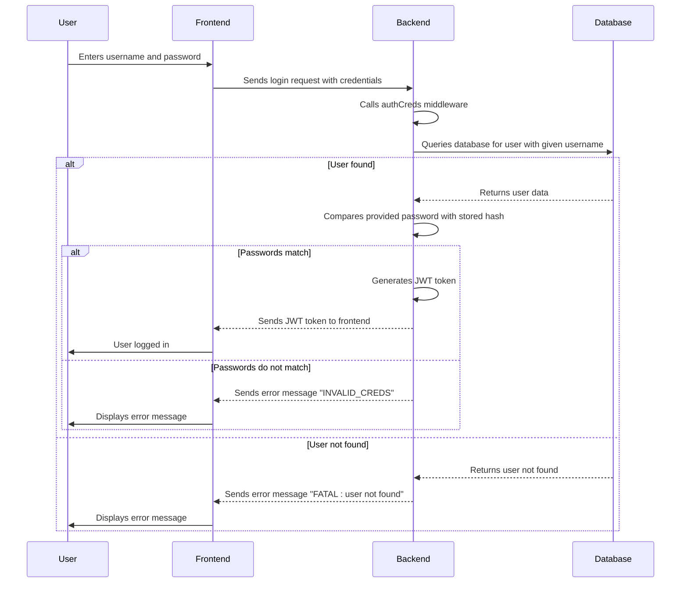

This diagram illustrates the user authentication workflow. The frontend sends the user's credentials to the backend, which then verifies them against the database. If the credentials are valid, the backend generates a JWT token and sends it back to the frontend.

**Code Example (User Authentication Middleware):**

```typescript
export const authCreds = async(c:Context,next:Next)=>{
    const {username,password} = await c.req.json()
    const prisma  = await getPrismaClient(c);
    const user = await prisma.user.findUnique({
        where : {
            username
        }
    })
    if(user){
        const verified = await bcrypt.compare(password,user.password)
        if(verified){
            await next()
        }else{
            return c.json({
                msg : "Error : INVALID_CREDS, please try again!",success : false
            })
        }
    }else{
        return c.json({
            msg : "FATAL : user not found",success : false
        })
    }
}
```

### 4. Practical Usage Guide

#### 4.1. Displaying a Post Card

To display a post card, import the `BlogPostCard` component and pass the post data as a prop:

```typescript
import BlogPostCard from "./components/postCard";

const MyComponent = ({ postData }) => {
  return (
    <BlogPostCard post={postData} />
  );
};
```

#### 4.2. Implementing User Authentication

To implement user authentication, use the middleware functions provided in `userMiddleware.ts`. For example, to protect a route that requires authentication, use the `userAuth` middleware:

```typescript
import { Hono } from 'hono'
import { userAuth } from './userMiddleware';

const app = new Hono()

app.get('/protected', userAuth, (c) => {
  return c.json({ message: 'This is a protected route' })
})
```

### 5. Important Implementation Details and Gotchas

*   **Date Formatting:** The `formatDate` function in both `SinglePostView.tsx` and `postCard.tsx` uses `toLocaleDateString` to format dates. Ensure that the locale ("en-IN") is appropriate for your target audience.
*   **Description Sanitization:** The `sanitizedDescription` function in `postCard.tsx` uses `DOMPurify` to sanitize the post description. This is crucial to prevent XSS vulnerabilities.  Pay attention to the `ALLOWED_TAGS` and `ALLOWED_ATTR` options to ensure that the desired HTML elements and attributes are preserved.
*   **Error Handling:**  Both frontend components include basic error handling for data fetching and image loading.  Implement more robust error handling and logging in a production environment.
*   **JWT Secret:** The `JWT_SECRET` environment variable in `userMiddleware.ts` must be securely stored and managed.  Do not expose this secret in your codebase.
*   **CORS Configuration:** Ensure that your backend API is properly configured to handle Cross-Origin Resource Sharing (CORS) requests from the frontend.

### 6. Common Issues and Troubleshooting

*   **Post Not Found:** If a post is not found, `SinglePostView.tsx` will display a loading skeleton indefinitely.  Implement a more user-friendly error message.
*   **Image Loading Errors:** If an image fails to load, `SinglePostView.tsx` and `postCard.tsx` will display a fallback image or placeholder.  Consider using an image optimization service to improve image loading performance and reliability.
*   **Authentication Failures:** If user authentication fails, the `userAuth` middleware will return an error message.  Ensure that the JWT token is valid and that the user has the necessary permissions.
*   **Database Connection Errors:** If the backend is unable to connect to the database, the API will return an error.  Check your database connection settings and ensure that the database server is running.

### 7. Advanced Configuration and Customization Options

*   **Customizing the Post Card:**  You can customize the appearance of the `BlogPostCard` component by modifying its CSS styles or by passing additional props to control its behavior.
*   **Implementing Custom Sharing Options:**  You can add custom sharing options to `SinglePostView.tsx` by integrating with other social media APIs or by implementing your own sharing functionality.
*   **Extending the User Model:**  You can extend the user model in the backend by adding additional fields to the `User` table in your database schema.  You will also need to update the `userMiddleware.ts` file to handle these new fields.
*   **Custom Error Handling:** Implement custom error handling logic in the frontend and backend to provide more informative error messages and improve the user experience.

### 8. Performance Considerations and Optimization Strategies

*   **Code Splitting:** Use code splitting to reduce the initial load time of your application.
*   **Caching:** Implement caching on the backend to reduce database load and improve API response times.
*   **Image Optimization:** Optimize images to reduce their file size and improve loading performance.
*   **Database Optimization:** Optimize your database queries to improve performance.
*   **CDN:** Use a Content Delivery Network (CDN) to serve static assets such as images and JavaScript files.

### 9. Security Implications and Best Practices

*   **XSS Prevention:**  Always sanitize user input to prevent Cross-Site Scripting (XSS) vulnerabilities.  The `sanitizedDescription` function in `postCard.tsx` provides an example of how to sanitize HTML content.
*   **CSRF Protection:**  Implement Cross-Site Request Forgery (CSRF) protection to prevent malicious websites from making unauthorized requests on behalf of your users.
*   **Authentication and Authorization:**  Use strong authentication and authorization mechanisms to protect your API endpoints and data.  The `userMiddleware.ts` file provides several middleware functions for user authentication and authorization.
*   **Data Validation:**  Validate all user input to prevent data injection attacks.  The `userCredsValidation` function in `userMiddleware.ts` provides an example of how to validate user credentials.
*   **Secure Storage of Secrets:**  Store sensitive information such as API keys and database passwords securely.  Do not expose these secrets in your codebase.
*   **Regular Security Audits:**  Conduct regular security audits to identify and address potential vulnerabilities.
